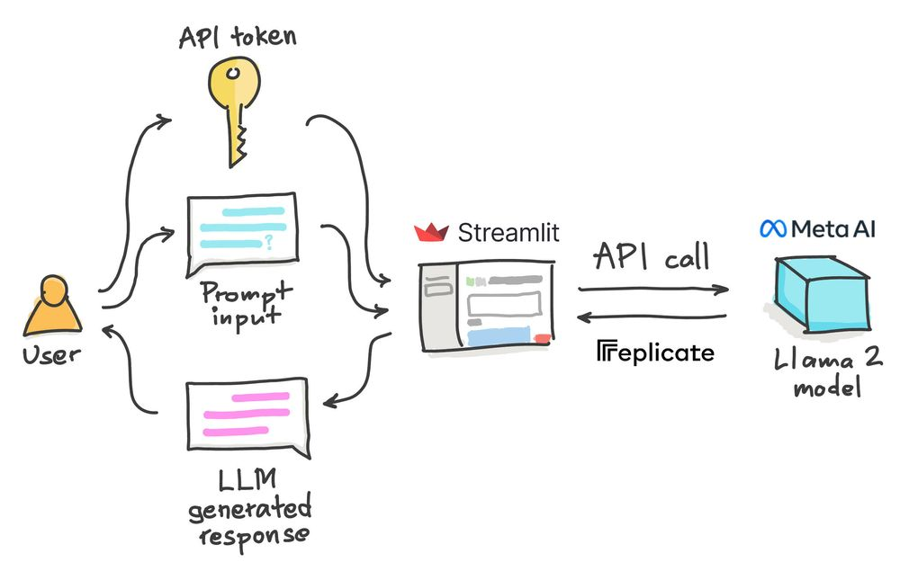

# Estudo do Llama em Inteligência Artificial

## Introdução
O Llama2 é um modelo de linguagem de grande escala de código aberto lançado recentemente pela Meta AI.
Existem três versões do Llama2 disponíveis: 7 bilhões de parâmetros, 13 bilhões de parâmetros e 70 bilhões de parâmetros.
O Llama2 tem várias características importantes, como superar outros modelos de linguagem em testes de raciocínio, proficiência em codificação e conhecimento.
O llama é uma ferramenta emergente na inteligência artificial, conhecida por sua eficácia na resolução de problemas complexos. Sua capacidade de otimização e adaptabilidade o tornam uma escolha atraente para uma variedade de aplicações em IA. No mundo da pesquisa e desenvolvimento de algoritmos, o llama está ganhando destaque como uma poderosa ferramenta da meta.

## Importância do Uso do Llama em IA

O llama é uma ferramenta de IA poderosa e versátil que tem ganhado destaque na comunidade de IA. Sua capacidade de processar grandes volumes de dados, aprender padrões complexos e realizar tarefas automatizadas o torna uma escolha popular em uma variedade de aplicações de IA, como processamento de linguagem natural, visão computacional e análise de dados.

Ao utilizar o llama em projetos de IA, pode-se aproveitar sua eficiência e escalabilidade para desenvolver sistemas mais inteligentes e eficazes. Além disso, sua capacidade de adaptação a diferentes domínios e problemas torna-o uma ferramenta valiosa para a inovação e o avanço da IA em diversos setores.

Este projeto visa explorar as possibilidades do uso do llama no projeto de IA de processamento de linguagem natural em Língua portuguesa do C4AI - Inova - USP, atrelando-o a bibliotecas do python como [Haystack](https://haystack.deepset.ai/)  para maximizar sua eficácia e aplicabilidade. 🚀🧠🔍

## Fazendo o ChatBot

O chatbot é construído em Python usando as bibliotecas Streamlit e Replicate. O usuário fornece um token API e uma mensagem de prompt, e o Llama 2 gera uma resposta que é exibida no aplicativo.


O objetivo principal é usar os dados obtidos do DPR pela biblioteca [Haystack](https://haystack.deepset.ai/) treinados utilizado a versão traduzida do natrual questions para português.

---
### App
Para Rodar o app criado utilizando a biblioteca streamlit é necessário somente utilizar o comando (na pasta 4.llama): 
``` 
$ streamlit run llama_app.py 
```
---
Você pode acompanhar nosso projeto completo: [Projeto NPL IA - C4AI  ](https://github.com/Eduds007/LanguageModels) 📈✨
